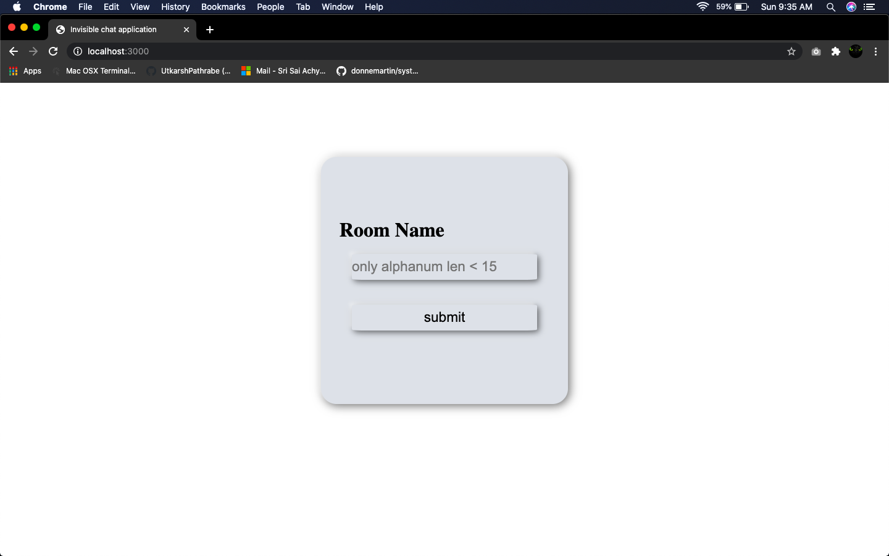
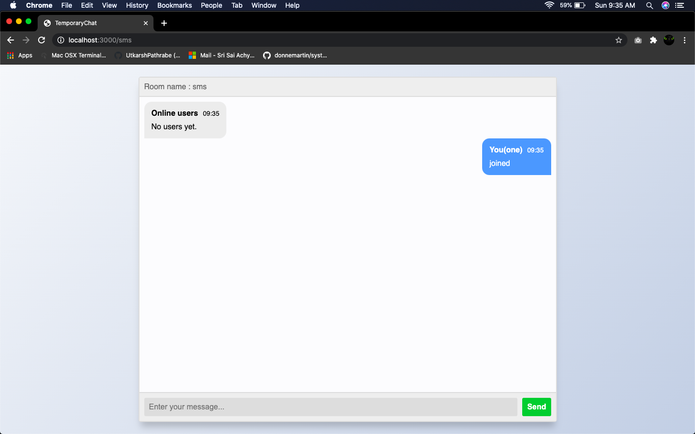
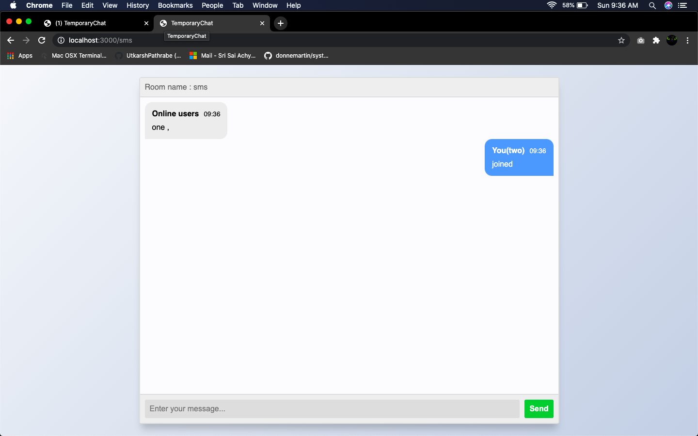

# disappearing_rooms
a place where persons can join a temporary room and chat.

## starting the server
```bash
npm run devStart
```

## using application

type this url
```sh
localhost:3000
```


enter the room name and your nickname to join that room





## used UI from 
>https://codepen.io/sajadhsm/pen/odaBdd?editors=1010
